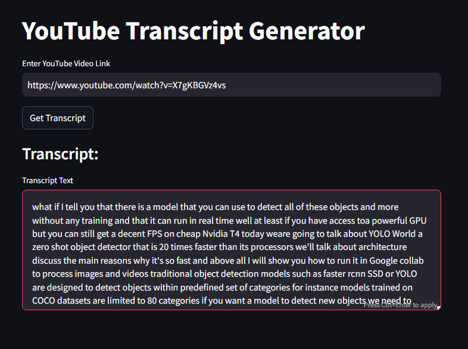

# YouTube Transcript Generator

This is a simple web application built with Streamlit that allows users to generate transcripts for YouTube videos. It utilizes the YouTube Transcript API to fetch the transcripts based on the provided YouTube video link.



## How to Use

1. Clone the repository to your local machine:

```bash
git clone https://github.com/SyedAffan10/YouTube-Transcript-Generator.git
```

2. Install the required dependencies. You can install them via pip:

```bash
pip install -r requirements.txt
```

3. Run the application:

```bash
streamlit run app.py
```

4. Once the application is running, you will see an input field where you can enter the YouTube video link.

5. After entering the link, click on the "Get Transcript" button to fetch the transcript for the provided video.

6. If the transcript is available, it will be displayed in the text area below. Otherwise, a message indicating that the transcript is not available for the video will be shown.

## Requirements

- Python >= 3.8
- Streamlit
- youtube_transcript_api
